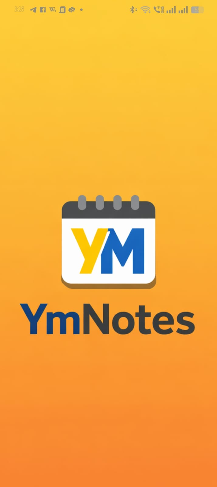
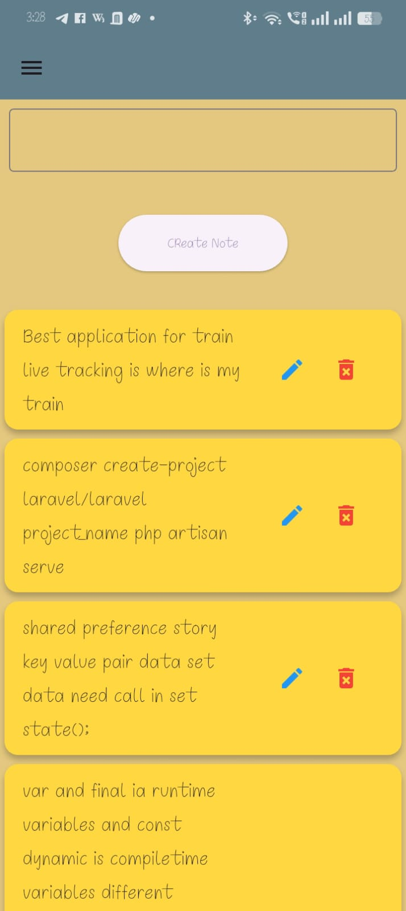
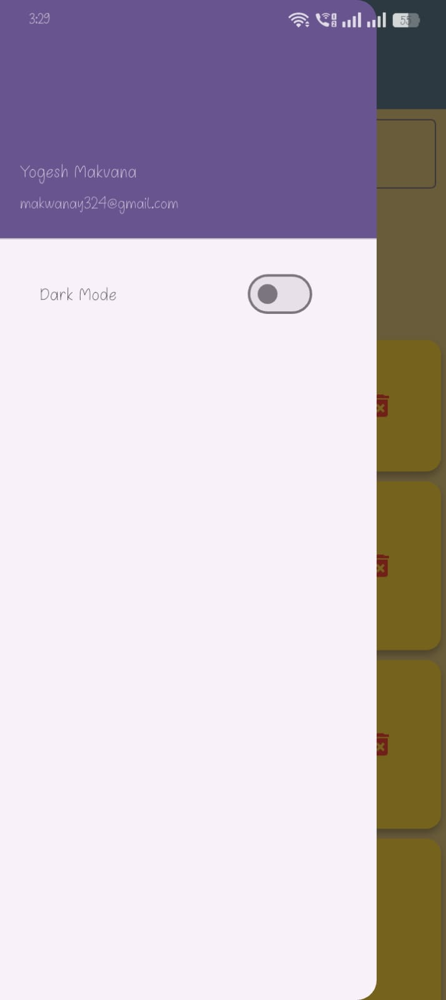
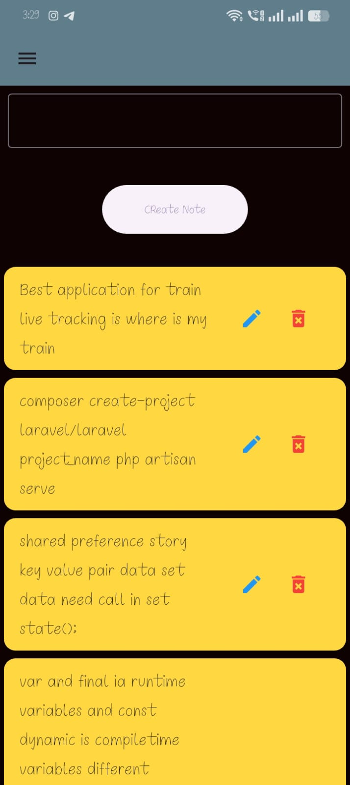
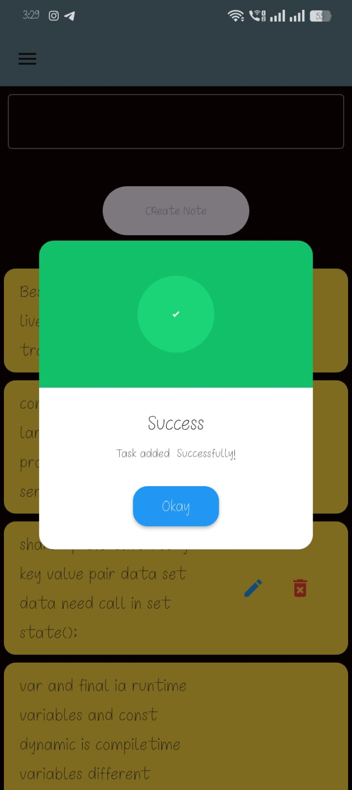
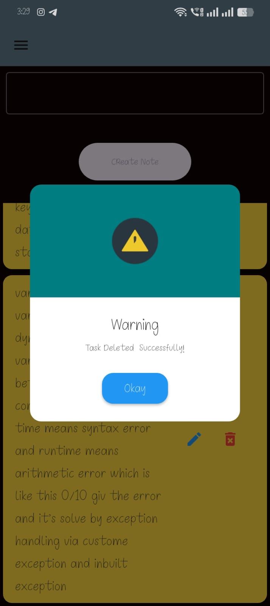
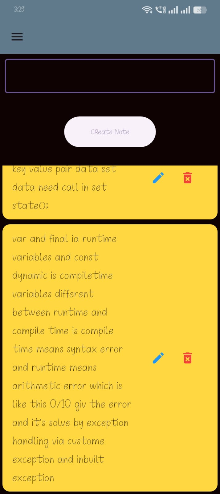

A simple Notes Application built using Flutter that allows users to create and manage notes locally.
The app stores data using SharedPreferences and includes Dark/Light Theme switching from a Drawer menu.

This project was created during my Flutter internship to practice local storage, UI design, and state handling.

🚀 Features
📝 Add Notes
📖 Read Notes
🗑 Delete Notes

💾 Local Storage using SharedPreferences

🌙 Dark Mode / ☀️ Light Mode Toggle

📂 Navigation Drawer

⚡ Fast and lightweight UI built with Flutter

🛠 Tech Stack

Framework: Flutter

Language: Dart

Local Storage: SharedPreferences

IDE: Visual Studio Code

## App Screenshots

  
  

  
  

  
  
  

